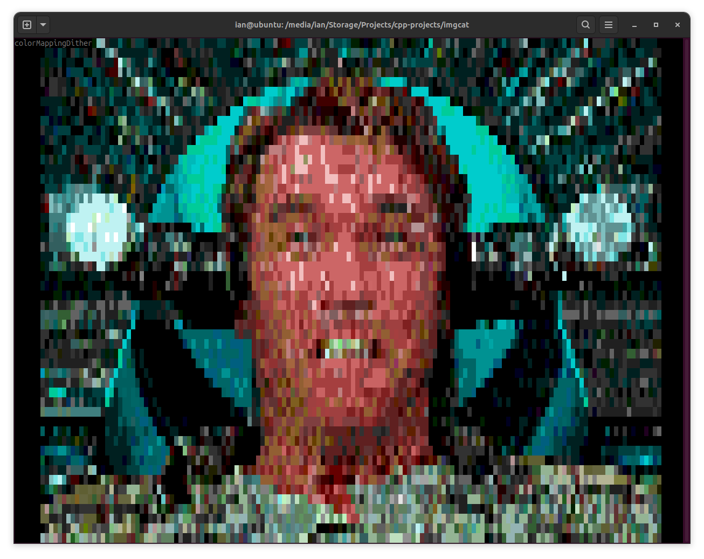
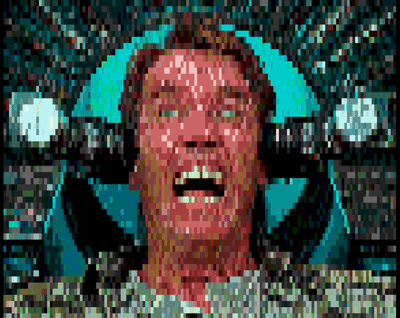

### imgcat



### vidcat



### Controls

```
p - change mapping algorithm
wasd/arrow keys - pan
, z - zoom in
. x - zoom out
0 - reset pan / zoom
1 - use two characters for each pixel
l - show debug info
```

### Building

These are the commands I use, mileage may vary

I no longer target Windows but my libraries were written to support them at one point

```
g++ imgcat.cpp -Ithird_party -I../console ../console/console.linux.cpp ../console/advancedConsole.cpp -lncursesw -o imgcat.o -g -O2
g++ vidcat.cpp -I../console ../console/console.linux.cpp ../console/advancedConsole.cpp -o vidcat.o -lopencv_core -lopencv_highgui -lopencv_videoio -lopencv_imgproc -lncursesw -I/usr/include/opencv4 -L/usr/lib/x86_64-linux-gnu/ -lportaudio
```